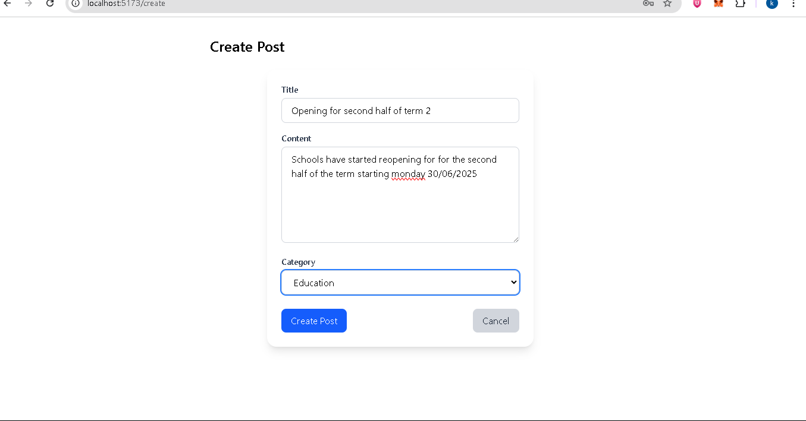

# MERN Blog App

A full-stack blog application built with the MERN stack (MongoDB, Express, React, Node.js) that allows authenticated users to create, view, and manage blog posts by category.

---

## Features

-- **User Authentication** (JWT-based)
-- **Create, Read, Update, Delete Posts**
-- **Category-based post organizatio**
-- **RESTFUL API (Express & Mongoose)**
-- **MongoDB integration**
-- **React Frontend with Tailwind Css**
-- **Context API for global state management**
-- **Protected routes for logged-in users**
-- **Form validation with React Hook Form**

---

## Tech Stack
| Frontend | Backend | Database |
|----------|---------|----------|
| React, React Router, Tailwind, React Hook Form | Node.js, Express, Mongoose | MongoDB Atlas / Local |

---

## Project Structure

├── client/ # React frontend
│ ├── components/
│ ├── contexts/
│ ├── hooks/
│ ├── pages/
│ ├── services/
│ ├── App.jsx
│ └── main.jsx
├── server/ # Express backend
│ ├── controllers/
│ ├── models/
│ ├── routes/
│ ├── middlewares/
│ └── server.js
├── .env
├── package.json
└── README.md

## Installation and setup

### 1. Clone the Repository

https://github.com/PLP-MERN-Stack-Development/week-4-mern-integration-assignment-KelvinMbugii.git

### 2. Setup the Backend
cd server
npm install

-- create .env file in the server
-- start the backend
  npm run dev

### 3. Setup the Frontend
cd ../client
npm install
npm run dev

### Screenshots of the application

